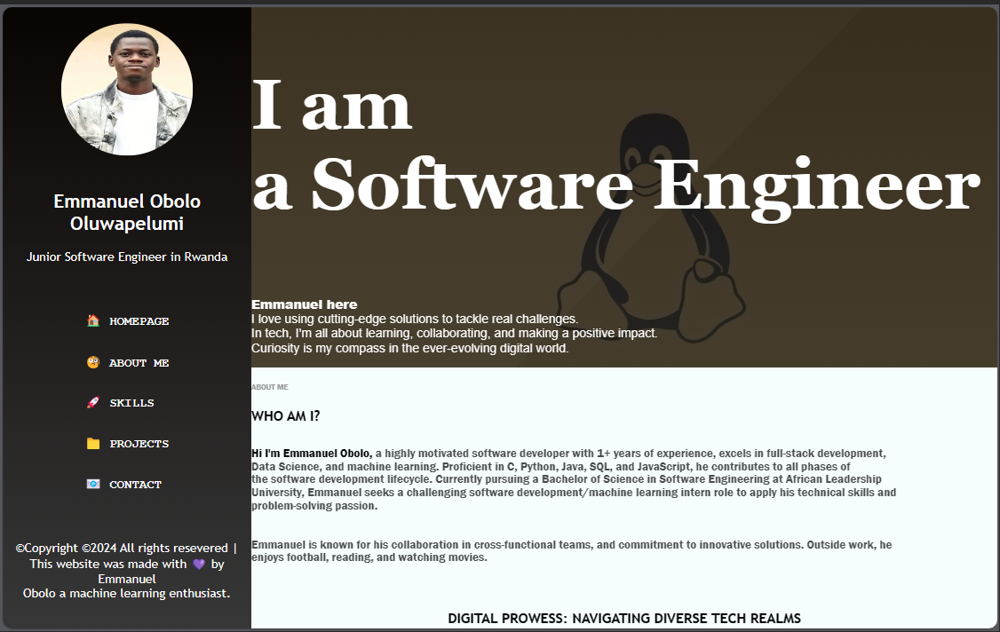

# Portfolio Page



## Table of Contents

- [Description](#description)
- [Features](#features)
- [Getting Started](#getting-started)
  - [Prerequisites](#prerequisites)
  - [Installation](#installation)
- [Usage](#usage)
- [Built With](#built-with)
- [Contributing](#contributing)
- [License](#license)
- [Contact](#contact)

## Description

This is the source code for Emmanuel Obolo Oluwapelumi's portfolio page. It showcases my skills, projects, and contact information in an interactive and visually appealing manner.

## Features

- Responsive design for various screen sizes.
- Dynamic switching of images based on screen size.
- Interactive navigation with underline effect.
- Automated content switching in the "Home" section.
  
## Web Infrastructure

This portfolio is hosted on a custom web infrastructure built by the me. The setup includes load balancing, SSL termination, web servers, and firewall configurations.

### Load Balancer (HAProxy)

The project utilizes HAProxy as a load balancer to distribute incoming web traffic across multiple web servers, ensuring efficient handling of requests.

### SSL (Certbot)

SSL certificates are managed using Certbot, providing secure communication over HTTPS. This ensures the confidentiality and integrity of the data exchanged between users and the web server.

### Web Servers (Nginx)

Nginx serves as the web server, handling incoming requests and serving the static content of the portfolio. It is configured to work seamlessly with the load balancer and provides a reliable and scalable environment.

### Firewall (UFW)

The firewall setup is managed using UFW (Uncomplicated Firewall), enhancing the security of the web infrastructure by controlling incoming and outgoing traffic.

## Getting Started

### Prerequisites

- Web browser (Google Chrome, Firefox, Safari, Internet Explorer, Opera Mini etc.)

### Installation

1. Clone the repository:

   ```bash
   git clone https://github.com/olugbeminiyi2000/portfolio-website.git
   ```
2. Navigate to the project directory:

    ```bash
    cd portfolio-website
    ```

3. Open the `porfolio.html` file in your web browser.

## Usage

- Explore different sections of the portfolio using the navigation links.
- Check out the projects in the "Projects" section, with links to GitHub repositories.

## Built With

- HTML5
- CSS3
- JavaScript

## Contributing

1. Fork the project.
2. Create your feature branch:

    ```bash
    git checkout -b feature/new-feature
    ```

3. Commit your changes:

    ```bash
    git commit -m 'Add some feature'
    ```

4. Push to the branch:

    ```bash
    git push origin feature/new-feature
    ```

5. Open a pull request.

## License

This project is licensed under the MIT License - see the [LICENSE](LICENSE) file for details.

## Contact

**Emmanuel Obolo Oluwapelumi**  
Email: [e.obolo@alustudent.com](mailto:e.obolo@alustudent.com)  
LinkedIn: [Emmanuel Obolo](https://www.linkedin.com/in/emmanuel-obolo/)
